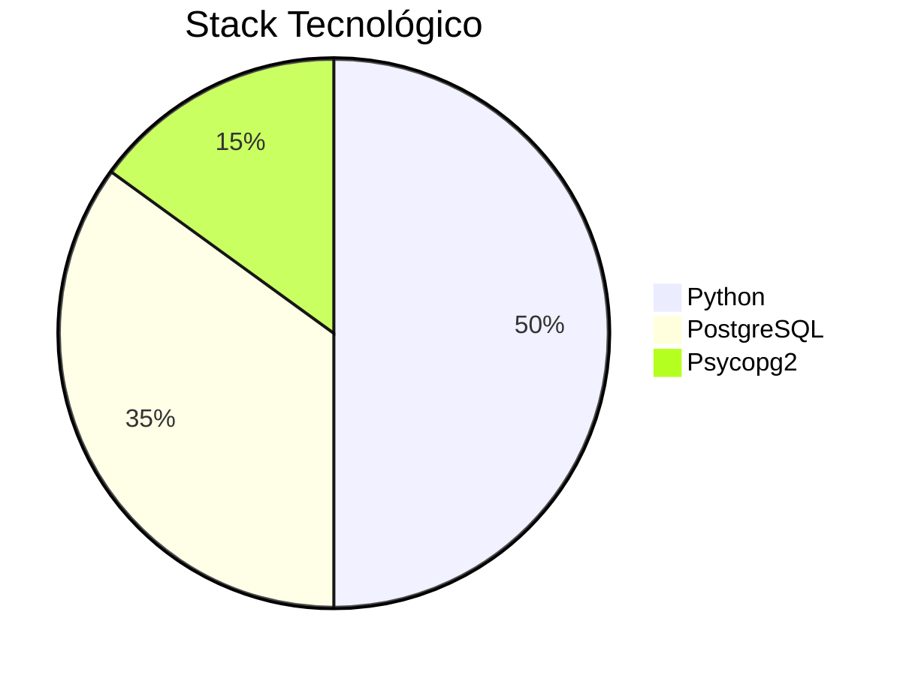

# 🗃️ Sistema CRUD Completo con PostgreSQL

> *"Implementación profesional de operaciones Create-Read-Update-Delete con Python y PostgreSQL"*

## 🌟 Características Principales
- ✅ Funcionalidad CRUD completa con Python puro
- 🐘 Integración nativa con PostgreSQL
- 🔐 Validación de datos avanzada
- 🚀 Optimizado para entornos de producción

## 🛠️ Tecnologías Utilizadas

